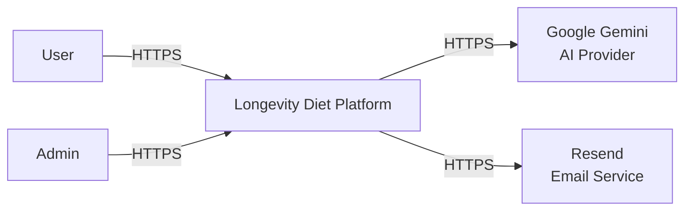

# C0 - System Context

The platform is educational and planning-focused. It does not provide diagnosis, treatment, disease prediction, lifespan prediction, or medical advice.

The diagram intentionally omits internal microservices, databases, and RabbitMQ. Those are shown in `C1-Internal-Architecture.md`.
