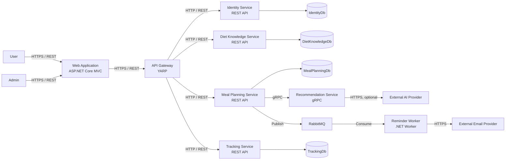

# C1 - Internal Architecture

```mermaid
flowchart LR
    User[User]
    Admin[Admin]
    Web[Web Application\nASP.NET Core MVC]
    Gateway[API Gateway\nYARP]

    Identity[Identity Service\nREST API]
    Diet[Diet Knowledge Service\nREST API]
    Meal[Meal Planning Service\nREST API]
    Tracking[Tracking Service\nREST API]
    Recommendation[Recommendation Service\ngRPC]
    Worker[Reminder Worker\n.NET Worker]
    Rabbit[RabbitMQ]

    IdentityDb[(IdentityDb)]
    DietDb[(DietKnowledgeDb)]
    MealDb[(MealPlanningDb)]
    TrackingDb[(TrackingDb)]
    Email[External Email Provider]
    AI[External AI Provider]

    User -->|HTTPS / REST| Web
    Admin -->|HTTPS / REST| Web
    Web -->|HTTPS / REST| Gateway

    Gateway -->|HTTP / REST| Identity
    Gateway -->|HTTP / REST| Diet
    Gateway -->|HTTP / REST| Meal
    Gateway -->|HTTP / REST| Tracking

    Identity --> IdentityDb
    Diet --> DietDb
    Meal --> MealDb
    Tracking --> TrackingDb

    Meal -->|gRPC| Recommendation
    Recommendation -->|HTTPS, optional| AI
    Meal -->|Publish| Rabbit
    Rabbit -->|Consume| Worker
    Worker -->|HTTPS| Email
```

Each REST service owns its database. Cross-service references are IDs only.
