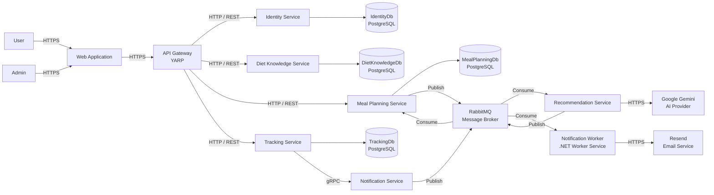

# C1 - Internal Architecture

```mermaid
flowchart LR
    User[User]
    Admin[Admin]
    Web[Web Application]
    Gateway[API Gateway\nYARP]

    Identity[Identity Service]
    Diet[Diet Knowledge Service]
    Meal[Meal Planning Service]
    Tracking[Tracking Service]
    Recommendation[Recommendation Service]
    Notification[Notification Service]
    Worker[Notification Worker\n.NET Worker Service]
    Rabbit[RabbitMQ\nMessage Broker]

    IdentityDb[(IdentityDb\nPostgreSQL)]
    DietDb[(DietKnowledgeDb\nPostgreSQL)]
    MealDb[(MealPlanningDb\nPostgreSQL)]
    TrackingDb[(TrackingDb\nPostgreSQL)]
    Gemini[Google Gemini\nAI Provider]
    Resend[Resend\nEmail Service]

    User -->|HTTPS| Web
    Admin -->|HTTPS| Web
    Web -->|HTTPS| Gateway

    Gateway -->|HTTP / REST| Identity
    Gateway -->|HTTP / REST| Diet
    Gateway -->|HTTP / REST| Meal
    Gateway -->|HTTP / REST| Tracking

    Identity --> IdentityDb
    Diet --> DietDb
    Meal --> MealDb
    Tracking --> TrackingDb

    Meal -->|Publish| Rabbit
    Rabbit -->|Consume| Recommendation
    Recommendation -->|HTTPS| Gemini
    Recommendation -->|Publish| Rabbit
    Rabbit -->|Consume| Meal

    Tracking -->|gRPC| Notification
    Notification -->|Publish| Rabbit
    Rabbit -->|Consume| Worker
    Worker -->|HTTPS| Resend
```

Recommendation Service and Notification Service are stateless in the current scope and do not own databases.
