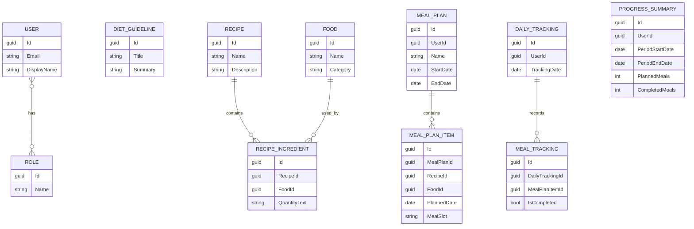

# Conceptual ERD

Cross-service relationships such as `MealPlan.UserId`, `MealPlanItem.RecipeId`, `MealPlanItem.FoodId`, and `MealTracking.MealPlanItemId` are ID references only, not cross-database foreign keys.
