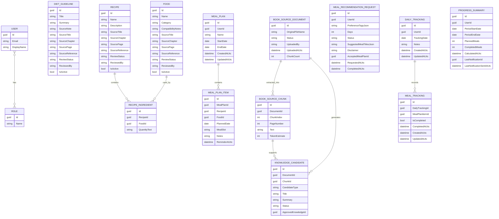

# Conceptual ERD

Cross-service relationships such as `MealPlan.UserId`, `MealPlanItem.RecipeId`, `MealPlanItem.FoodId`, and `MealTracking.MealPlanItemId` are ID references only, not cross-database foreign keys.

Meal scheduling is represented by `MealPlanItem.PlannedDate`, `MealSlot`, and `ReminderAtUtc` rather than a separate `MealSchedule` table in the current workflow.

Book-source tables are internal to Diet Knowledge review. `KnowledgeCandidate.ApprovedKnowledgeId` stores the created guideline/food identifier after approval but is not modeled as a foreign key because candidates can approve into more than one managed content type.
